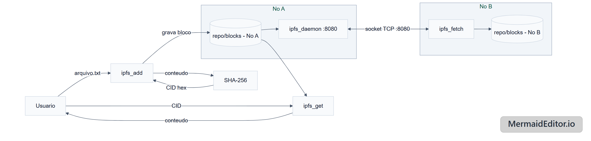
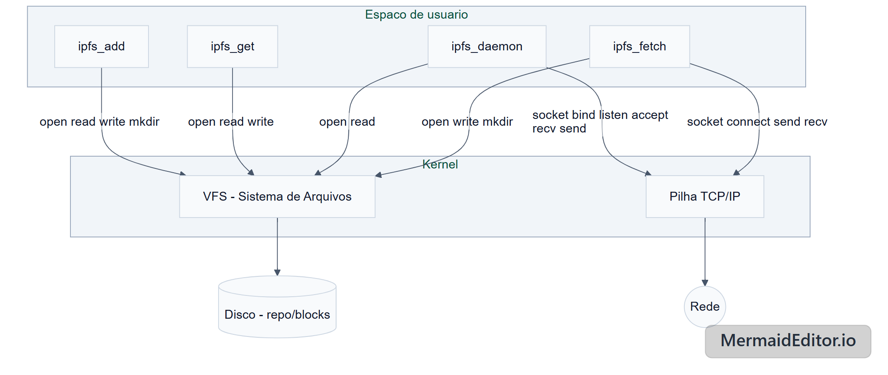

# mini-IPFS

**Disciplina:** Sistemas Operacionais  
**Período:** 2026.1  
**Equipe:**  
Yasmim Ferreira dos Santos - 600736   
Antonio Marcos Justino Carneiro - 511911   
Arthur Lopes Pamplona - 570357   
Gustavo Moraes Teles - 570387   

## Introdução

Este projeto implementa um mini-IPFS em C, escrito para a disciplina de Sistemas
Operacionais. Ele demonstra, na prática, como uma aplicação usa chamadas de sistema (syscalls)
de arquivo e de rede para implementar dois conceitos centrais do IPFS real: endereçamento por
conteúdo (o endereço de um dado é o hash do próprio conteúdo, não uma localização) e troca de
blocos entre nós via rede.

O foco é tornar visível o caminho que uma operação de I/O percorre até o kernel.

## Objetivo geral

Demonstrar como uma aplicação em espaço de usuário utiliza syscalls do Linux para I/O de arquivos
e comunicação em rede, usando o IPFS como caso de estudo.

## Objetivos específicos

- Calcular o CID (identificador de conteúdo) de um arquivo via SHA-256.
- Armazenar e recuperar blocos localmente, endereçados pelo hash do conteúdo.
- Transferir blocos entre dois nós via TCP.
- Mapear cada operação do programa às syscalls correspondentes.

## O que é o IPFS

O IPFS (*InterPlanetary File System*) é um protocolo P2P de armazenamento e distribuição de
arquivos em que cada conteúdo é identificado pelo hash de si mesmo - o CID - em vez de por uma
localização (como uma URL). Isso significa que o mesmo conteúdo tem sempre o mesmo endereço, e
qualquer nó da rede que o possua pode servi-lo a quem pedir.

## Arquitetura

O projeto tem 4 programas independentes, todos operando sobre a mesma pasta `repo/blocks/`:

- **`ipfs_add <arquivo>`**: lê um arquivo, calcula o SHA-256, usa o hash em hexadecimal como
  **CID**, e salva o conteúdo em `repo/blocks/<cid>`.
- **`ipfs_get <cid>`**: abre `repo/blocks/<cid>` e imprime o conteúdo no stdout.
- **`ipfs_daemon`**: sobe um servidor TCP na porta 8080. Recebe um CID, procura o bloco
  localmente e o envia de volta (ou um status de erro, se não tiver).
- **`ipfs_fetch <ip> <cid>`**: conecta a um `ipfs_daemon` remoto, pede um CID, valida a
  integridade do que recebeu e salva em `repo/blocks/<cid>` local.





## Chamadas de sistema

| Chamada de sistema | Arquivos                        | Papel no projeto                | Relação com o SO |
|---------------------|----------------------------------|----------------------------------|--------------------|
| `open`              | add, get, daemon, fetch          | Abrir arquivos/blocos            | Cria descritor via VFS |
| `read`               | add, get, daemon                 | Ler conteúdo do disco            | Transfere bytes do FS para o buffer do processo |
| `write`              | add, get, fetch                  | Gravar bloco/saída               | Escreve do buffer para FS/stdout via kernel |
| `close`              | todos                            | Liberar descritor                | Kernel libera recurso da tabela de fd |
| `mkdir`              | add, fetch                       | Criar `repo/blocks`              | Cria diretório no FS via VFS |
| `fstat`              | add                              | Descobrir tamanho do arquivo     | Consulta metadados do inode |
| `socket`             | daemon, fetch                    | Criar endpoint TCP               | Aloca estrutura de socket no kernel |
| `setsockopt`         | daemon                           | `SO_REUSEADDR`                   | Ajusta opções do socket no kernel |
| `bind`               | daemon                           | Associar à porta 8080            | Registra endereço/porta na pilha TCP/IP |
| `listen`             | daemon                           | Modo de escuta                   | Cria fila de conexões pendentes |
| `accept`             | daemon                           | Aceitar cliente                  | Retira conexão da fila; novo fd |
| `connect`            | fetch                            | Conectar ao daemon               | Inicia handshake TCP (3-way) via kernel |
| `send`               | daemon, fetch                    | Enviar bytes                     | Enfileira dados na pilha TCP/IP |
| `recv`               | daemon, fetch                    | Receber bytes                    | Lê dados do buffer de socket do kernel |

## Compilação

Cada programa é compilado individualmente com `gcc`. `ipfs_add` e `ipfs_fetch` usam SHA-256
(OpenSSL), por isso precisam da flag `-lcrypto` no final:

```bash
gcc -Wall -Wextra -std=c11 -g ipfs_add.c common.c -o ipfs_add -lcrypto
gcc -Wall -Wextra -std=c11 -g ipfs_get.c common.c -o ipfs_get
gcc -Wall -Wextra -std=c11 -g ipfs_daemon.c common.c -o ipfs_daemon
gcc -Wall -Wextra -std=c11 -g ipfs_fetch.c common.c -o ipfs_fetch -lcrypto
```

Para limpar os binários gerados:

```bash
rm -f ipfs_add ipfs_get ipfs_daemon ipfs_fetch
```

## Uso de cada programa

```bash
./ipfs_add <arquivo>        # calcula o CID, salva o bloco, imprime o CID
./ipfs_get <cid>             # imprime o conteudo do bloco no stdout
./ipfs_daemon                 # sobe o servidor na porta 8080
./ipfs_fetch <ip> <cid>       # busca um bloco de um daemon remoto
```

## Demonstração com dois nós

`ipfs_daemon` e `ipfs_fetch` só fazem sentido em pastas diferentes, simulando duas máquinas —
cada uma com seu próprio `repo/blocks/`. Nunca rode o daemon e o fetch na mesma pasta, ou o teste
não prova nada (o bloco já estaria lá).

Exemplo de roteiro manual (dois terminais, duas pastas diferentes simulando dois nós):

```bash
# Terminal 1 - No A (tem o arquivo)
mkdir noA && cd noA
cp ../ipfs_add ../ipfs_daemon .
echo "ola mundo" > arquivo.txt
./ipfs_add arquivo.txt          # anota o CID impresso
./ipfs_daemon                    # sobe o servidor na porta 8080

# Terminal 2 - No B (quer o arquivo)
mkdir noB && cd noB
cp ../ipfs_fetch .
./ipfs_fetch 127.0.0.1 <CID>     # busca, verifica integridade e salva
```

## Limitações conhecidas

- Um arquivo = um bloco (sem chunking); não há Merkle DAG.
- Sem DHT: o IP do peer é sempre informado manualmente.
- Sem deduplicação nem download paralelo.
- Daemon atende um cliente por vez (single-threaded), sem tratamento de sinal para shutdown
  limpo.
- Sem autenticação/criptografia no canal TCP.
